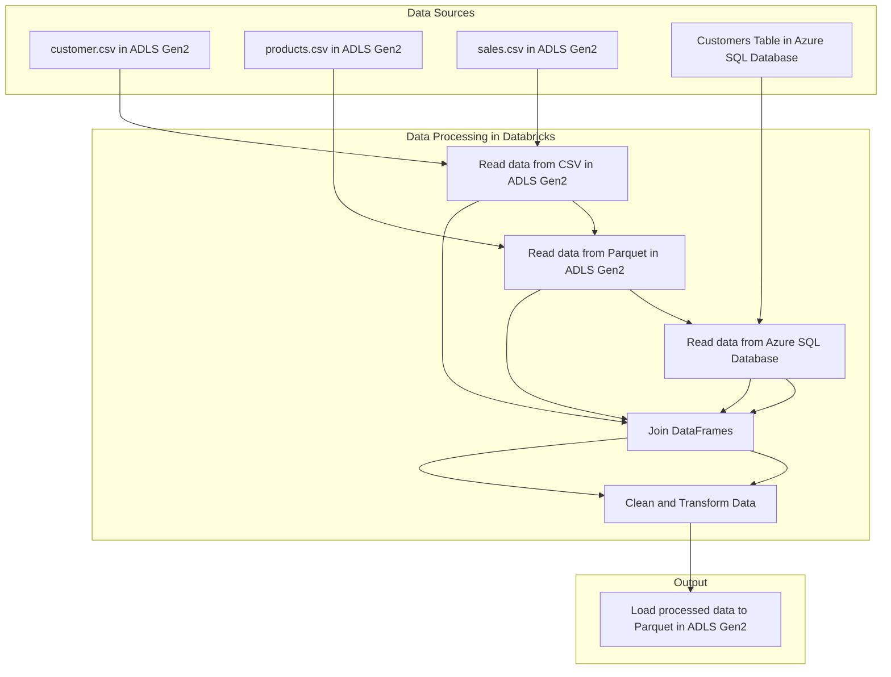

# **Project Pipeline on Azure Data Factory**
---

## ภาพรวมโปรเจกต์ (Overview)
โปรเจคนี้ถูกสร้างขึ้นมาเพื่อจำลองการใช้งาน Microsoft Azure Services ต่างๆ โดยบริการต่างๆดังนี้
1. Azure Data Lake Storage Gen2
2. Azure Databricks 
3. Azure Data Factory
4. Azure SQL Database
5. Azure Synapse Analytics
---

## Data Sources
- CSV
---

## สถาปัตยกรรม / Workflow Diagram

---
## **Tech Stack**
1. Azure Data Lake Storage Gen2
2. Azure Databricks 
3. Azure Data Factory
4. Azure SQL Database
5. Azure Synapse Analytics

6. Python

7. SQL
